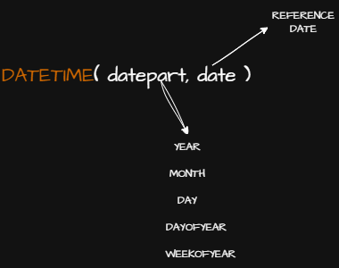
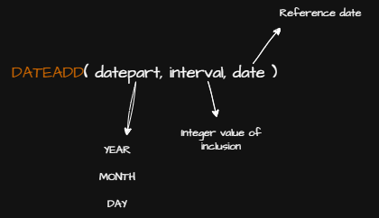
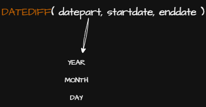
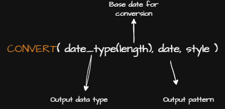

# ERP Database Project

This is a project for a database created during a Database course.  
The goal is to build a database for an ERP (Enterprise Resource Planning) system.

## 📘 About the Project

ERP systems help companies manage different areas like:

- Sales  
- Inventory  
- Finance  
- Human Resources  
- Purchases  

## ☁️ Technology Stack

- **SQL Server** as the database system  
- **Microsoft Azure** for hosting the database  
- Database design tool: Draw.io or DBDesigner  
- Git and GitHub for version control  

## 💡 Objectives

- Practice SQL with SQL Server  
- Learn how to use Azure SQL Database  
- Understand ERP systems and their data  
- Create tables and relationships  
- Write useful queries  
- Document the learning process

--- 
## SQL Server Functions 

### To Rename Table or Column
Use the `sp_rename` stored procedure to rename tables or columns in SQL Server.
-- Rename a table
EXEC sp_rename 'OldTableName', 'NewTableName';

-- Rename a column
EXEC sp_rename 'TableName.OldColumnName', 'NewColumnName', 'COLUMN';

### Working with Date

#### Datetime

Represents date and time values ranging from 1753-01-01 to 9999-12-31
<p align="left">
  
</p>

Example:
```sql
  -- Get the month of current date
  SELECT DATETIME(month, GETDATE())
```

#### Dateadd
Adds a specified interval (e.g., day, month, year) to a date.
<p align="left">
  
</p>

Example:
```sql
  -- Add 1 month to current date
  SELECT DATEADD(month, 1, GETDATE());
```

#### Datediff
Returns the difference between two dates in specified units (e.g., days, months).
<p align="left">
  
</p>

Example:
```sql
  -- Get number of days between two dates
  SELECT DATEDIFF(day, '2025-01-01', GETDATE());
```

#### Convert
Converts data from one type to another, commonly used for formatting date
<p align="left">
  
</p>

Example:
```sql
  -- Convert current date to dd/mm/yyyy format
  SELECT CONVERT(VARCHAR, GETDATE(), 103);
```

## ✅ Status

This project is **in progress**.  
I will update it during the course as I learn more.
---

Thanks for visiting!
